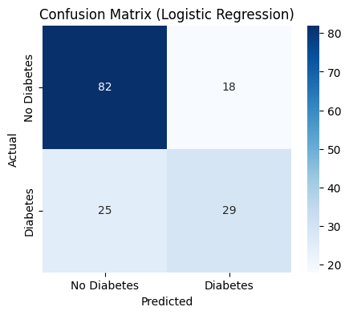
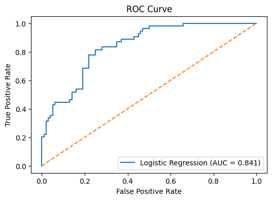

# Diabetes Risk Prediction with Machine Learning

## Project Overview

This project applies machine learning models to predict diabetes risk using patient-level clinical data.

It combines clinical reasoning, feature engineering, and predictive modeling to identify key risk factors associated with diabetes.

This project demonstrates my transition from epidemiology and real-world evidence analysis into applied healthcare data science.

---

## Clinical / Business Relevance

Early identification of diabetes risk is critical for preventive care, patient stratification, and targeted clinical interventions.

This project reflects real-world evidence (RWE) thinking by:
- Translating clinical knowledge into meaningful features
- Identifying high-risk patient groups
- Supporting population health and clinical decision-making

---

## Key Results

- Logistic Regression ROC-AUC: **0.84**
- Random Forest ROC-AUC: **0.81**

Logistic Regression slightly outperformed Random Forest while remaining more interpretable, which is valuable in healthcare applications.

---

## Dataset

This project uses the **Pima Indians Diabetes Dataset**, a widely used dataset for healthcare machine learning research.

The dataset contains clinical variables such as:

- Glucose level
- BMI
- Age
- Blood pressure
- Insulin level
- Diabetes pedigree function
- Pregnancy history

Target variable:
Outcome

Where:
1 = Diabetes  
0 = No Diabetes

---

## Feature Engineering

To enhance model interpretability and incorporate clinical intuition, several engineered features were created:

| Feature | Description |
|------|------|
| is_elderly | Indicator for patients aged ≥60 |
| high_bmi | BMI ≥30 (obesity indicator) |
| high_glucose | Glucose ≥140 indicator |
| metabolic_risk | Combined metabolic stress score |
| pregnancy_age_interaction | Interaction between pregnancy count and age |

These features reflect known clinical risk factors for metabolic disease.

---

## Machine Learning Models

Two models were trained and compared.

### Logistic Regression

Used as a baseline interpretable model.

Evaluation metric:
ROC-AUC

Result:
ROC-AUC = 0.84

---

### Random Forest

A nonlinear ensemble model used for comparison.

Result:
ROC-AUC = 0.81

---

## Key Predictors

The most important predictors identified by the models include:

- Glucose
- Metabolic risk score
- BMI
- Diabetes pedigree function
- Age

These predictors are consistent with established clinical risk factors for diabetes.

---

## Model Evaluation

Performance was evaluated using:

- ROC-AUC
- Confusion Matrix
- Classification Report

### Confusion Matrix

### ROC Curve

---

## Clinical Risk Stratification

Predicted probabilities were used to stratify patients into risk groups:

| Risk Group | Predicted Probability |
|------|------|
| Low Risk | < 0.30 |
| Medium Risk | 0.30 – 0.60 |
| High Risk | > 0.60 |

Patients in the high-risk group showed substantially higher observed diabetes prevalence, suggesting the model may support clinical risk stratification.

---

## Technologies Used

- Python
- Pandas
- NumPy
- Scikit-learn
- Matplotlib
- Seaborn

---

## Project Structure

diabetes-risk-prediction  
│  
├── healthcare_ml_diabetes_prediction.ipynb  
├── README.md  

---

## Key Takeaways

This project demonstrates an end-to-end healthcare machine learning workflow:

- data exploration  
- feature engineering based on clinical knowledge  
- interpretable baseline modeling  
- nonlinear model comparison  
- model interpretation and risk stratification  

The results highlight how clinically informed feature engineering can improve model interpretability and predictive performance in healthcare datasets.

---

## Next Steps

- Handle implausible zero values as missing data  
- Apply feature scaling for Logistic Regression  
- Perform hyperparameter tuning  
- Use cross-validation for more robust evaluation
